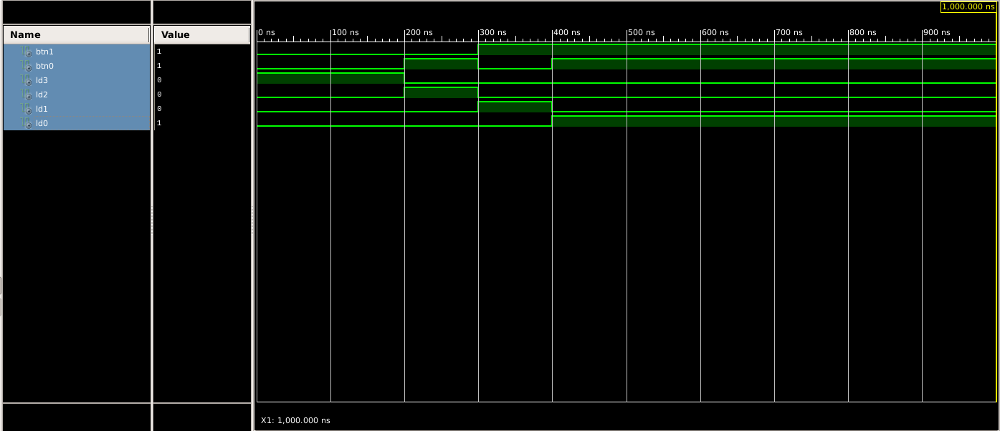

# Lab 2: Xilinx ISE Design Suite

#### Contents

1. [Lab prerequisites](#Lab-prerequisites)

## Lab prerequisites

| **A** | **B** | **A>B** | **A=B** | **A<B** |
| :-: | :-: | :-: | :-: | :-: |
| 0 | 0 | 0 | 1 | 0 |
| 0 | 1 | 0 | 0 | 1 |
| 1 | 0 | 1 | 0 | 0 |
| 1 | 1 | 0 | 1 | 0 |

According to the truth table, create canonical SoP (Sum of Product) or PoS (Product of Sum) output forms as follows:

&nbsp;

&nbsp;

&nbsp;

&nbsp;

Create K-maps for all three functions.

&nbsp;

| **¬A** | **A** |  |                
| :-: | :-: | :-: | 
| 0 | 0 | **¬B** |        
| 0 | 1 | **B** |   

| **¬A** | **A** |  |      
| :-: | :-: | :-: |
| 1 | 0 | **¬B** |
| 0 | 1 | **B** |

| **¬A** | **A** |  |      
| :-: | :-: | :-: |
| 0 | 0 | **¬B** |
| 1 | 0 | **B** |

&nbsp;

Use the K-map to create the minimum  function.

&nbsp;

    
&nbsp;

> Equations and symbols were generated by [Online LaTeX Equation Editor](https://www.codecogs.com/latex/eqneditor.php) as an Encoded URL link.
>
&nbsp;
    
    &nbsp;
