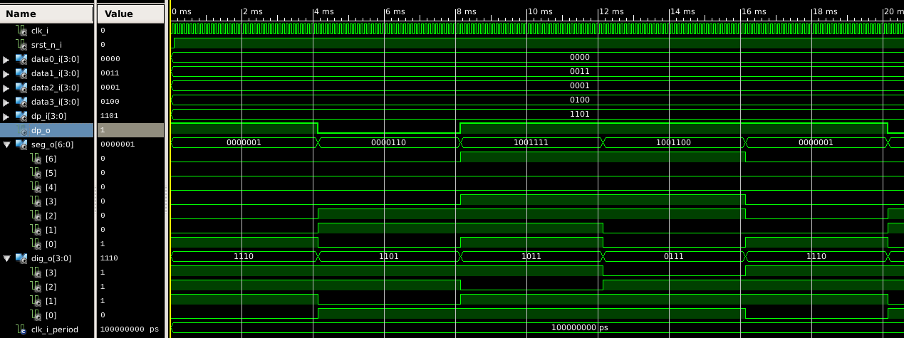

# Lab 6: Driver for seven-segment display

## Simulation

&nbsp;
    
    &nbsp;

## 1 Preparation tasks (done before the lab at home)

1. See [reference manual](../../Docs/coolrunner-ii_rm.pdf) of the Coolrunner board, find out the connection of 7-segment display, and complete the signal timing to display `03.14` value. Note that the duration of one symbol is 4&nbsp;ms.

    &nbsp;
    
    &nbsp;

> The figure above was created in [WaveDrom](https://wavedrom.com/) digital timing diagram online tool. The figure source code is as follows:
>
```javascript
{signal: [
  ['Digit position',
    {name: 'disp_dig_o(3)', wave: 'xx01..01..xx', },
    {name: 'disp_dig_o(2)', wave: 'xx101..01.xx', },
    {name: 'disp_dig_o(1)', wave: 'xx1.01..01xx', },
    {name: 'disp_dig_o(0)', wave: 'xx1..01..0xx', },
  ],
  ['Seven-segment data',
    {name: 'disp_seg_o',       wave: 'xx33335555xx', data: ['0','3','1','4','0','3','1','4'], },  
    {name: 'A: disp_seg_o(6)', wave: 'xx0.1.0.1.x.', },
    {name: 'B: disp_seg_o(5)', wave: 'xx0.......xx', },
    {name: 'C: disp_seg_o(4)', wave: 'xx0.......xx', },
    {name: 'D: disp_seg_o(3)', wave: 'xx0.1.0.1.xx', },
    {name: 'E: disp_seg_o(2)', wave: 'xx01..01..xx', },
    {name: 'F: disp_seg_o(1)', wave: 'xx01.0.1.0xx', },
    {name: 'G: disp_seg_o(0)', wave: 'xx10101010xx', },
  ],
  {name: 'Decimal point', wave: 'xx101..01.xx', },
],
  head: {
    text: '4ms   4ms   4ms   4ms   4ms   4ms   4ms   4ms',
  },
}
```


2. See how to make [signal assignments](https://github.com/tomas-fryza/Digital-electronics-1/wiki/Signal-assignments) outside and inside a process. What is the difference between combinational and sequential processes?

