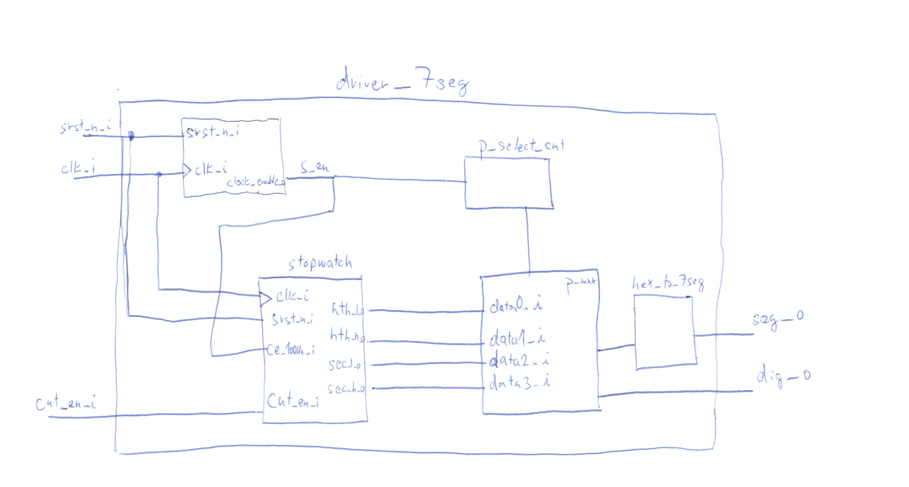

# Lab 7: Stopwatch

#### Objectives

In this laboratory exercise you will implement BCD counters. You will use the Xilinx Isim simulator or the EDA playground online tool. You will use a push button on the CoolRunner board as reset device, onboard clock signal with frequency of 10&nbsp;kHz for synchronization, and 7-segment display as output device

#### Simulation and diagram

&nbsp;
    
    &nbsp;
&nbsp;
    
    &nbsp;

