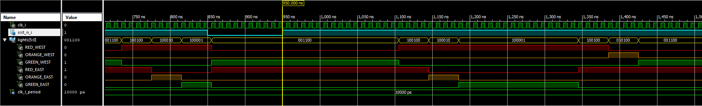
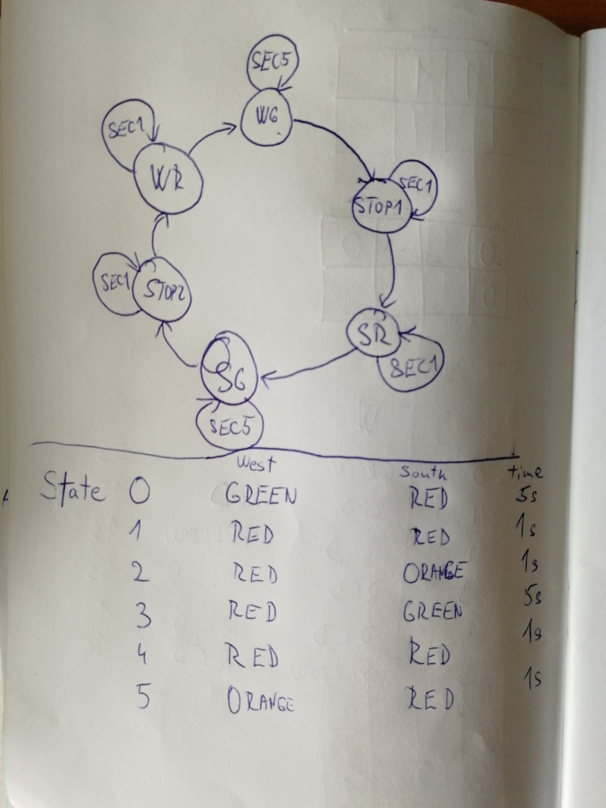

# Lab 8: Traffic light controller

#### Objectives

In this laboratory exercise you will implement a finite state machine, specifically a traffic light controller at a junction. You will use the Xilinx Isim simulator or the EDA playground online tool. You will use a push button on the CoolRunner board as reset device, onboard clock signal with frequency of 10&nbsp;kHz for synchronization, and CPLD expansion board LEDs as outputs.

## Simulation

&nbsp;
    
    &nbsp;
&nbsp;
    
    &nbsp;
####STATES
wr- West Go
stop1- Stop1
sr- South Ready
sg- South Go
stop2- Stop2
wr- West Ready
&nbsp;
    
    &nbsp;
&nbsp;
    
    &nbsp;    
