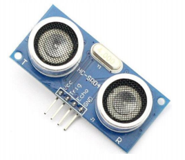
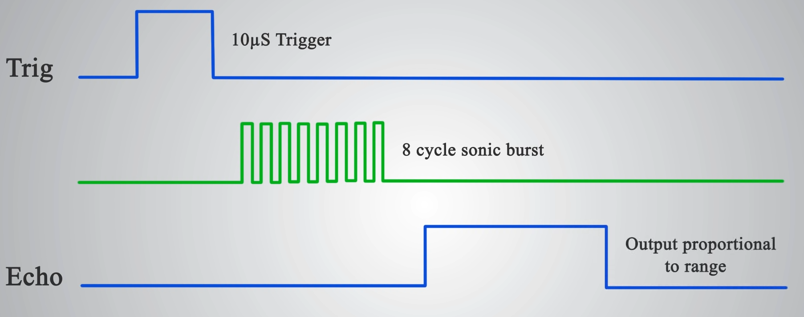

# Lab 9-13: Ultrazvukový měřič vzdálenosti HC-SR04

#### Obsah

1. [Úvod](#Úvod)
2. [Princip](#Princip)

3. [Code description](#Code-description)
4. [Video](#Video)
5. [Zdroje](#Zdroje)

## Úvod

&nbsp;
    
    &nbsp;
    
Tento modul umožňuje spolehlivou detekci v rozmezí 2 centimetrů až 4 metrů. Používá se u robotů a obecně pro měření prostoru před senzorem. Nejlépe měří cca první 2 metry od modulu, až na 3 mm přesně. Pracovní úhel detekce je okolo 15 stupňů. Na desce se nachází ultrazvukový vysílač, přijímač a integrované obvody pro zajištění správné funkce.

TBD

## Princip

Ultrazvukový měřič vyžaduje pro spuštění na vstup Trig signál (High) po dobu alespoň 10 mikrosekund. Modul vyšle vysokofrekvenční pulz (40 kHz). Po vyslání se spustí Echo (High). Pokud se signál se odrazí od překážky, přijímač jej zachytí a ukončí trvání Echo. Pomocí tohoto impulzu vypočítáme vzdálenost v centimetrech.  
Vyjdeme ze vzorce _s = t * v_. Za _v_ dosadíme rychlost zvuku při 20 _°C_ (343 _m/s_ -> 0,0343 _cm/us_), _t_ bude doba impulzu Echo podělená dvěma (měří signál odražený).

4 propojovací piny - VCC na +5V, GND na zem, Trig a Echo

&nbsp;
    
    &nbsp;

TBD

## Code description

TBD

## Video

TBD

## Zdroje

https://navody.arduino-shop.cz/navody-k-produktum/meric-vzdalenosti-ultrazvukovy.html
TBD
