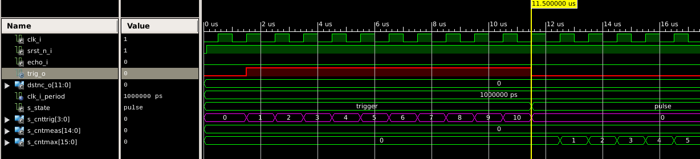
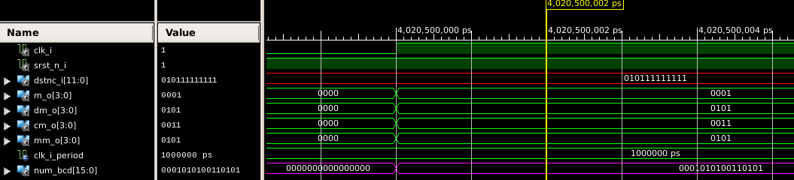

# Lab 9-13: Ultrazvukový měřič vzdálenosti HC-SR04

#### Obsah

1. [Úvod](#Úvod)
2. [Princip](#Princip)
3. [Implementace](#Implementace)
4. [Zdroje](#Zdroje)

## Úvod

&nbsp;
    
    &nbsp;
    
Tento modul umožňuje spolehlivou detekci v rozmezí 2 centimetrů až 4 metrů. Používá se u robotů a obecně pro měření prostoru před senzorem. Nejlépe měří cca první 2 metry od modulu, až na 3 mm přesně. Pracovní úhel detekce je okolo 15 stupňů. Na desce se nachází ultrazvukový vysílač, přijímač a integrované obvody pro zajištění správné funkce.

## Princip

Ultrazvukový měřič vyžaduje pro spuštění na vstup Trig signál (High) po dobu alespoň 10 mikrosekund. Modul vyšle vysokofrekvenční pulzy (40 kHz). Po vyslání se spustí Echo (High). Pokud se signál se odrazí od překážky, přijímač jej zachytí a ukončí trvání Echo. Pomocí tohoto impulzu vypočítáme vzdálenost v milimetrech.  

Vyjdeme ze vzorce _s = t * v_. Za _v_ dosadíme pro zjednodušení rychlost zvuku při 20 _°C_ jako konstantu, _t_ bude doba impulzu Echo. Rychlost převedeme na vhodné jednotky (340 _m/s_ -> 0,34 _mm/us_) a protože měříme signál odražený, podělíme dvěma (0,17). Číslo vyjádříme jako binární, abychom jej mohli přímo vynásobit dobou Echa. Výsledek poté převedeme zpátky pomocí konvertoru na dekadické číslo a po číslovkách vysvítíme na 7 segmentovém displeji. Poslední displej oddělíme desetinou čárkou, zobrazené číslo bude tedy v centimetrech.

&nbsp;
    
    &nbsp;

## Připojení HC-SR04 na Coolrunner-II CLPD starter board

Modul HC-SR04 má 4 propojovací piny - VCC (+5V), GND (zem), Trig a Echo (datové piny). FPGA Coolrunner ale nemá možnost připojení modulu s napájením 5V, proto je potřeba propojit ultrazvukový měřič s externím napájením. Vycházíme z těchto možností doporučených výrobcem v dokumentu [5V tollerance](/Labs/Project/5vtollerance.pdf). Zvolili jsme připojení za pomocí integrovaného obvodu (např. ON Semiconductor’s MC74VHC1GT50).
 
## Implementace

### Modul top

#### Schéma
&nbsp;
    
    
    
#### Test
&nbsp;
    
    &nbsp;
    _Echo (červeně) dlouhé 236 us. Tedy vzdálenost by měla být 236 * 0,17 = 40 mm._
&nbsp;
      
    _Vzdálenost s_dist (fialově) ukazuje správně 40 mm. Displej začíná vysvěcovat: první segment 1110 (oranžově) ukáže nulu 0000001 (červeně), druhý 1101 (červ.) + desetinná čárka (modře) čtyřku 1001100 a zbytek 1011 a 0111 budou nuly. Displeje se vysvěcují postupně po 4 _ms_. Uvidíme tedy 004.0 centimetrů._
#### Odkaz na kód: [top](/Labs/Project/prj_hc-sr04/Top.vhd)


### Ovladač hc-sr04 

#### Stavový diagram
&nbsp;
    
#### Popis stavů    
První stav Trigger nám umožní poslat přesně 10 us dlouhý trigger signál do modulu, který vypustí vysokofrekvenční impulzy z vysílače.
&nbsp;
    
    &nbsp;
    _Řídící signál trigger (červeně) trvá 10 us než přejde na další stav._
    
Druhý stav Pulse kontroluje, jestli se vyslané impulzy odrazily a vrátily na přijímač. Jestliže není vrácené echo detekované do 65 ms, vrátí se zpět na stav první.
&nbsp;
    
    &nbsp;
    _Stav Pulse čeká na odražený impulz echo (červeně) a následující stav Echo spustí čítač (fialově) na měření jeho délky._
    
Třetí stav Echo měří čas, jak dlouho je echo v aktivní úrovni.
&nbsp;
    
    
Čtvrtý stav Calc provede výpočet a převede daný čas na vzdálenost od překážky.

Pátý stav Reset čeká, aby celý proces trval alespoň 65 ms, výsledek měření přiřadí do výstupu a následně přejde do stavu prvního.
    
    &nbsp;
    _Stav Reset čeká na čítač s_cntMax (fialově), tedy 65 ms, a následně vypíše výsledek měření (červeně) a celý proces se opakuje._
#### Odkaz na kód: [hc-sr04 driver](/Labs/Project/prj_hc-sr04/hc_sr04.vhd)


### Převadeč binárního čísla na BCD (binary coded decimal)
#### BCD kód
&nbsp;
    
    &nbsp;
#### Algoritmus 
1. posuň o jeden bit doleva 
2. pokud má hodnotu rovnu nebo větší než 5, přičti 3
3. opakuj 1. a 2. do posledního bitu

&nbsp;
    
    &nbsp;

#### Test
&nbsp;
    
    &nbsp;
    _Dekadické zobrazení, vstupní číslo _dstnc_i_ (červeně) se rozdělí po číslovkách na stovky (metry), desítky (decimetry), jednotky (centimetry) a desetiny (milimetry)._    
&nbsp;
    
    &nbsp; 
    _Binární. Stejné vstupní číslo _dstnc_i_ (červeně) se podle algoritmu rozdělí na 4x 4 bity a těchto 16 bitů se následně vypíše do _num_bcd_ (fialově)._
#### Odkaz na kód: [binary to bcd converter](/Labs/Project/prj_hc-sr04/binary_2bcd.vhd)


### Clock enable
Rozdělí signál clock na nastavitelný počet period. Díky tomu můžeme clock signálem o dané frekvenci ovládat moduly v jiných intervalech. Používáme clock o 1 MHz (jedna perioda je 1 _us_), a aby se např. sedmisegmentové displeje zapínaly ve 4 _ms_ intervalech, musíme nastavit konstantu g_NPERIOD na 4000 (x"0FA0").
```vhdl
    --------------------------------------------------------------------
    -- Sub-block of clock_enable entity.
	CLK_EN : entity work.clock_enable
		generic map (
			g_NPERIOD => x"0FA0"	-- @ 4 ms if fclk = 1 MHz
		)
...
```
#### Odkaz na kód: [clock enable](/Labs/Project/prj_hc-sr04/clock_enable.vhd)

### Ovladač 7 segmentového displeje
#### Odkaz na kód: [7 segment display driver](/Labs/Project/prj_hc-sr04/driver_7seg.vhd)


### Převadeč hexadecimálního čísla na 7 segmentový displej
#### Odkaz na kód: [hex to 7 segment display](/Labs/Project/prj_hc-sr04/hex_to_7seg.vhd)


## Zdroje

https://navody.arduino-shop.cz/navody-k-produktum/meric-vzdalenosti-ultrazvukovy.html

https://dronebotworkshop.com/hc-sr04-ultrasonic-distance-sensor-arduino/

https://www.academia.edu/29188168/Obstacle_avoidance_robot_using_FPGA_VHDL

FPGA Basics #5: Distance meter https://www.youtube.com/watch?v=lLhFK_vE1ec

FPGA Basics #6: Binary to decimal https://www.youtube.com/watch?v=5SSLahxw7Vw

https://github.com/albaruizgo/CICT_Project_Binary-BCDconverter

