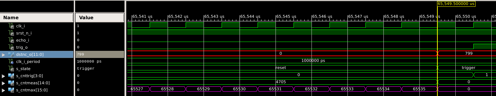

# Lab 9-13: Ultrazvukový měřič vzdálenosti HC-SR04

#### Obsah

1. [Úvod](#Úvod)
2. [Princip](#Princip)

3. [Code description](#Code-description)
4. [Video](#Video)
5. [Zdroje](#Zdroje)

## Úvod

&nbsp;
    
    &nbsp;
    
Tento modul umožňuje spolehlivou detekci v rozmezí 2 centimetrů až 4 metrů. Používá se u robotů a obecně pro měření prostoru před senzorem. Nejlépe měří cca první 2 metry od modulu, až na 3 mm přesně. Pracovní úhel detekce je okolo 15 stupňů. Na desce se nachází ultrazvukový vysílač, přijímač a integrované obvody pro zajištění správné funkce.

TBD

## Princip

Ultrazvukový měřič vyžaduje pro spuštění na vstup Trig signál (High) po dobu alespoň 10 mikrosekund. Modul vyšle vysokofrekvenční pulzy (40 kHz). Po vyslání se spustí Echo (High). Pokud se signál se odrazí od překážky, přijímač jej zachytí a ukončí trvání Echo. Pomocí tohoto impulzu vypočítáme vzdálenost v centimetrech.  
Vyjdeme ze vzorce _s = t * v_. Za _v_ dosadíme rychlost zvuku při 20 _°C_ (343 _m/s_ -> 0,0343 _cm/us_), _t_ bude doba impulzu Echo podělená dvěma (měří signál odražený).

4 propojovací piny - VCC na +5V, GND na zem, Trig a Echo

&nbsp;
    
    &nbsp;

TBD

## Pripojenie HC-SR04 ku Coolrunner-II
FPGA Coolrunner nemá možnosť pripojenia modulu s napájaním 5V preto je potrebné prepojiť modul HC-SR04 s externým napájaním. Vychádzame z týchto možností odporúčaných  výrobcom v dokumente [5V tollerance](/Labs/Project/5vtollerance.pdf). Zvolili sme pripojenie s pomocou integrovaného obvodu (napr. ON Semiconductor’s MC74VHC1GT50).

&nbsp;
    
    &nbsp;
## Code description
[top](/Labs/Project/hc-sr04_edit/Top.vhd)

[hc-sr04 driver](/Labs/Project/hc-sr04_edit/hc_sr04.vhd)

&nbsp;
    
    &nbsp;
    
První stav Trigger nám umožní poslat přesně 10 us dlouhý trigger signál do modulu, který vypustí vysokofrekvenční impulzy z vysílače.

&nbsp;
    
    &nbsp;
    _Řídící signál trigger (červeně) trvá 10 us než přejde na další stav._
    
Druhý stav Pulse kontroluje, jestli se vyslané impulzy odrazily a vrátily na přijímač. Jestliže není vrácené echo detekované do 65 ms, vrátí se zpět na stav první.

&nbsp;
    
    &nbsp;
    
Třetí stav Echo měří čas, jak dlouho je echo v aktivní úrovni.
 
&nbsp;
    
    &nbsp;
	
Čtvrtý stav Calc provede výpočet a převede daný čas na vzdálenost od překážky.

Pátý stav Reset čeká, aby celý proces trval alespoň 65 ms, výsledek měření přiřadí do výstupu a následně přejde do stavu prvního.

&nbsp;
    
    &nbsp;

[binary to bcd converter](/Labs/Project/hc-sr04_edit/binary_2bcd.vhd)

[clock enable](/Labs/Project/hc-sr04_edit/clock_enable.vhd)

[7 segment display driver](/Labs/Project/hc-sr04_edit/driver_7seg.vhd)

[hex to 7 segment display](/Labs/Project/hc-sr04_edit/hex_to_7seg.vhd)

TBD

## Video

TBD

## Zdroje

https://navody.arduino-shop.cz/navody-k-produktum/meric-vzdalenosti-ultrazvukovy.html
TBD
